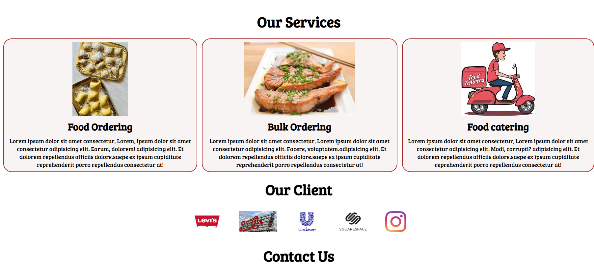
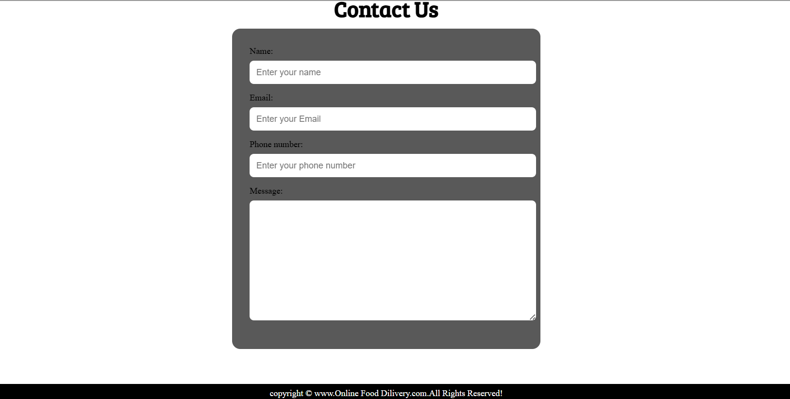

# 🍽️ Online Food Delivery Website

Welcome to **Online Food Delivery.com** — a sleek and responsive food ordering platform designed to showcase food ordering, catering, and bulk delivery services. This project is built with HTML and CSS, making it beginner-friendly and lightweight.

---

## 📸 Screenshots

### 🖼️ Home Page


### 🧾 Services Section



### 📞 Contact Us



---

## 💡 Features

- 🏠 Stylish Home Page with clear call-to-action
- 🍱 Service Boxes for Food Ordering, Bulk Orders, and Catering
- 🧾 Responsive Navigation Bar and Mobile Support
- 👨‍💼 Clients Section to showcase partners
- 📬 Contact Form for user inquiries
- 📱 Mobile Friendly with responsive layout using `phone.css`

---

## 🛠️ Tech Stack

- HTML5
- CSS3
- Google Fonts (Baloo Bhai, Bree Serif)
- Media Queries for responsiveness

---

## 📁 Folder Structure
```
├── index.html              # Main webpage structure
├── style.css               # Styling and layout
├── phone.css               # Mobile responsiveness styles
├── README.md               # Project documentation
└── assets/                 # Images and media assets
    ├── logo.png
    ├── img1.jpg
    ├── img2.jpg
    ├── img3.jpg
    ├── logo1.png
    ├── logo2.png
    ├── logo3.png
    ├── logo4.png
    ├── logo5.png
    ├── screenshot1.png     # Home Page preview
    ├── screenshot2.png     # Services Section preview
    └── screenshot3.png     # Contact Section preview

````

---

## 📦 How to Clone

```bash
git clone https://github.com/Toheed-Ahmed/Online-Food-Delivery.git
cd Online-Food-Delivery
````

Open `index.html` in your browser to view the website.

---

## © License

This project is open-source and free to use for educational or personal purposes.

---

> Designed with ❤️ by [Toheed Ahmed](https://github.com/Toheed-Ahmed)

```

---

Let me know if you'd like a matching **favicon**, **custom banner**, or even **deployment steps** for GitHub Pages!
```
